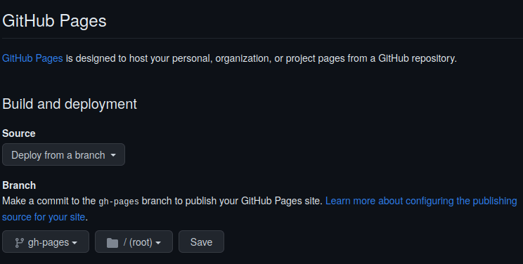
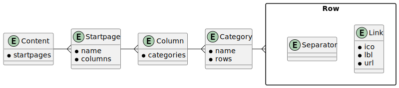

# Startpages


[Other colorschemes](_docs/colorschemes.md)

Start pages are designed to replace the default browser's new tab page. So
every time you open a new tab, one of your start pages will be displayed,
showing you a list of your favorite links and links to other startpages.

This is a template repository. You can create your own GitHub repository on
your own account using this template. Once created, you can edit the
configuration file (you can also use the GitHub web editor). For each link, you
can specify an icon and organize the links into categories and columns.

When you commit the changes, the already prepared GitHub action will parse your
configuration file and generate the GitHub pages, which you can then use to
override the browser's new tab location setting.

## Setting up the repository

First, create your own repository from this template repository. You can use
following
[guide](https://docs.github.com/en/repositories/creating-and-managing-repositories/creating-a-repository-from-a-template).

Next, activate the GitHub Pages in the settings:



## Defining the content

Content is defined in the `content/startpages.yaml` file with the following
schema:



By default, the icons come from [Font
Awesome](https://fontawesome.com/search?o=r&m=free&f=brands) and for easier
copy-paste it uses the whole snippet in the format:

```
<i class="fa-solid fa-magnifying-glass"></i>
```

You can easily copy the snippet by opening the icon popup window and clicking
on the code.

## Styling

Styles are defined inside the `sass/styles.scss`. The easiest way is to choose
one of the predefined colorscheme by uncommenting the import line. The
colorschemes were taken from
[samme/base16-styles](https://github.com/samme/base16-styles).

## Changing startpage template

Startpage template is in `templates/startpage.html`, and it will be processed by
[Tera](https://tera.netlify.app/) template engine.

## Public directory

All content of `public/` will be copied to generated site. You can use this
directory to store images, or JavaScript files which you can reference in your
modified startpage template.

## Generating site locally

Install [Rust and Cargo](https://www.rust-lang.org/tools/install).

Then you can run the generator in watch mode, so every time you update a file
the generator will regenerate the `_site/`.

```
cargo install cargo-watch
cargo watch -x run
```

## Merging changes in template

Once the new repository is created from this template, it starts with a clean
slate and does not include the history of the template. Therefore, Git will not
allow a simple merge. You will need to use the `--allow-unrelated-histories`
flag.

## Contributing

The repository that you generate will not share history with this template
repository. If you want to contribute you will need to fork the template repo
conventional way.

For feature requests, questions and new ideas please use
[Discussions](https://github.com/PrimaMateria/startpages-template/discussions)
and [Issues](https://github.com/PrimaMateria/startpages-template/issues) use
for reporting bugs.
